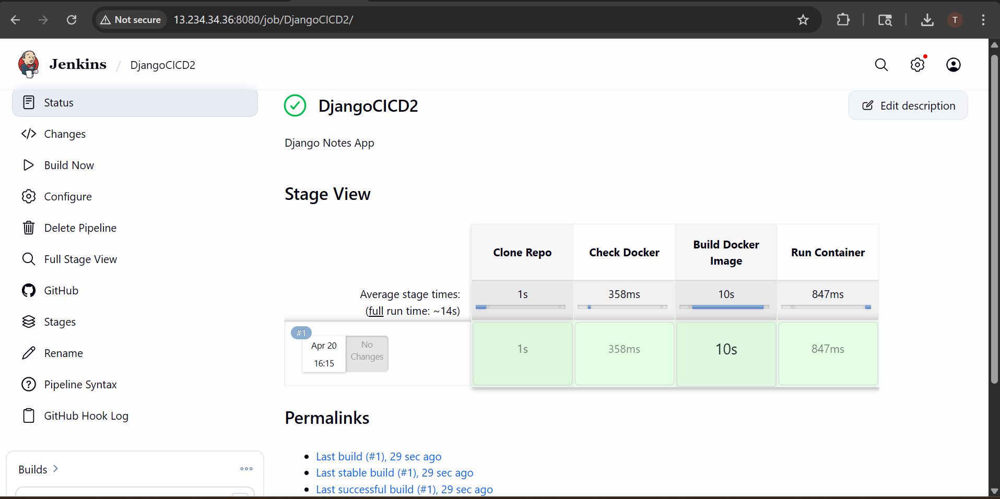
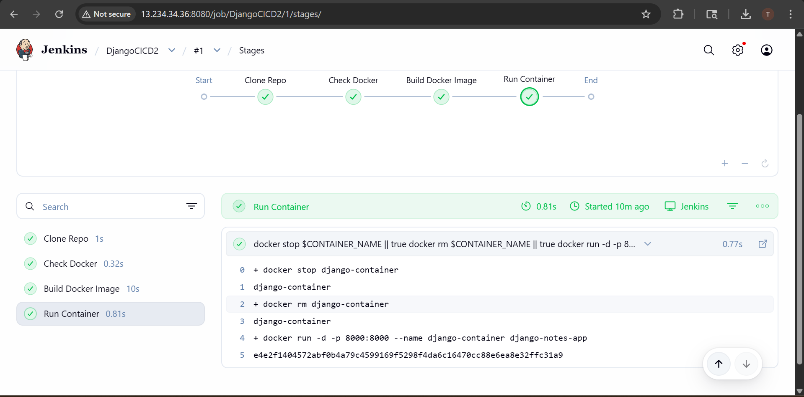
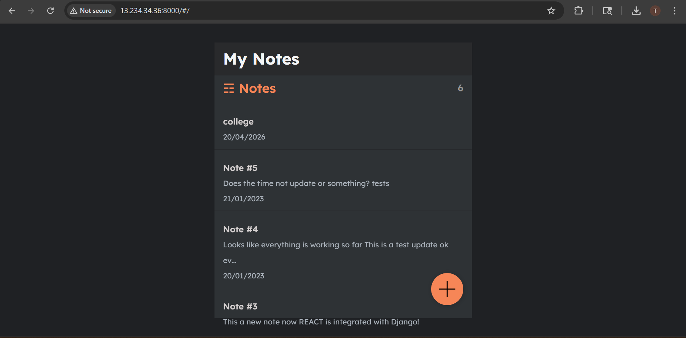

# 🚀 Django Notes App CI/CD Project

## 📌 Overview

This project demonstrates a complete CI/CD pipeline using Jenkins and Docker to deploy a Django application.

---

## ⚙️ Tech Stack

* Python (Django)
* Docker
* Jenkins
* AWS EC2

---

## 🔄 CI/CD Pipeline Flow

1. Jenkins pulls code from GitHub
2. Builds Docker image
3. Runs container
4. Deploys Django app

---

## 📸 Screenshots

### Jenkins Pipeline Success



### Docker Container Running



### Application Running



---

## ▶️ How to Run

```bash
docker build -t django-notes-app .
docker run -d -p 8000:8000 django-notes-app
```

---

## 🌐 Access App

http://13.234.34.36:8000

---

## 🎯 Key Learnings

* CI/CD pipeline setup using Jenkins
* Docker containerization
* Debugging real-world deployment issues

---
