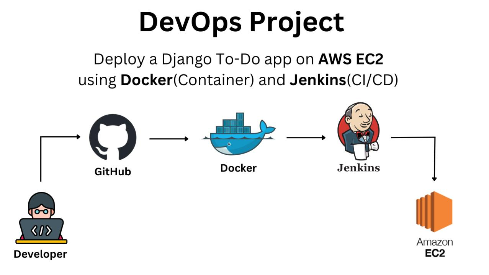

# 🚀 Django Notes App CI/CD Project

## 📌 Overview

This project demonstrates a complete CI/CD pipeline using Jenkins and Docker to deploy a Django application.

---
## 🏗️ Architecture


## 🏗️ Architecture Diagram Explanation

This project follows a CI/CD pipeline architecture:

1. **GitHub Repository**

   * Stores the Django application code
   * Triggers Jenkins pipeline on updates

2. **Jenkins Server (AWS EC2)**

   * Pulls latest code from GitHub
   * Executes pipeline stages

3. **Docker**

   * Builds Docker image from Django app
   * Runs containerized application

4. **Deployment**

   * Container is exposed via port `8000`
   * Accessible through EC2 public IP

---


## ⚙️ Tech Stack

* Python (Django)
* Docker
* Jenkins
* AWS EC2

### 🔄 Flow Summary

GitHub → Jenkins → Docker Build → Docker Run → Live Application

---

## 🔄 CI/CD Pipeline Flow

1. Jenkins pulls code from GitHub
2. Builds Docker image
3. Runs container
4. Deploys Django app

---

## 📸 Screenshots

### Jenkins Pipeline Success


### Docker Container Running


### Application Running


---

## ▶️ How to Run

```bash
docker build -t django-notes-app .
docker run -d -p 8000:8000 django-notes-app
```

---

## 🌐 Access App

http://13.234.34.36:8000

---

## 🎯 Key Learnings

* CI/CD pipeline setup using Jenkins
* Docker containerization
* Debugging real-world deployment issues

---
